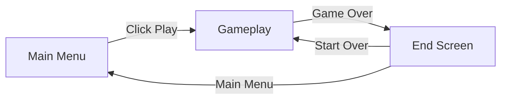
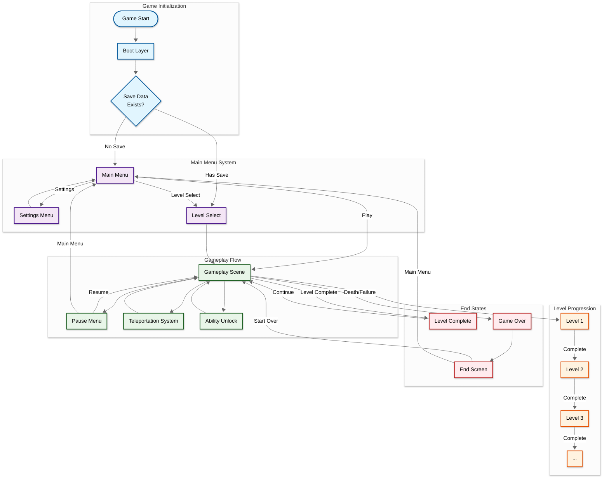
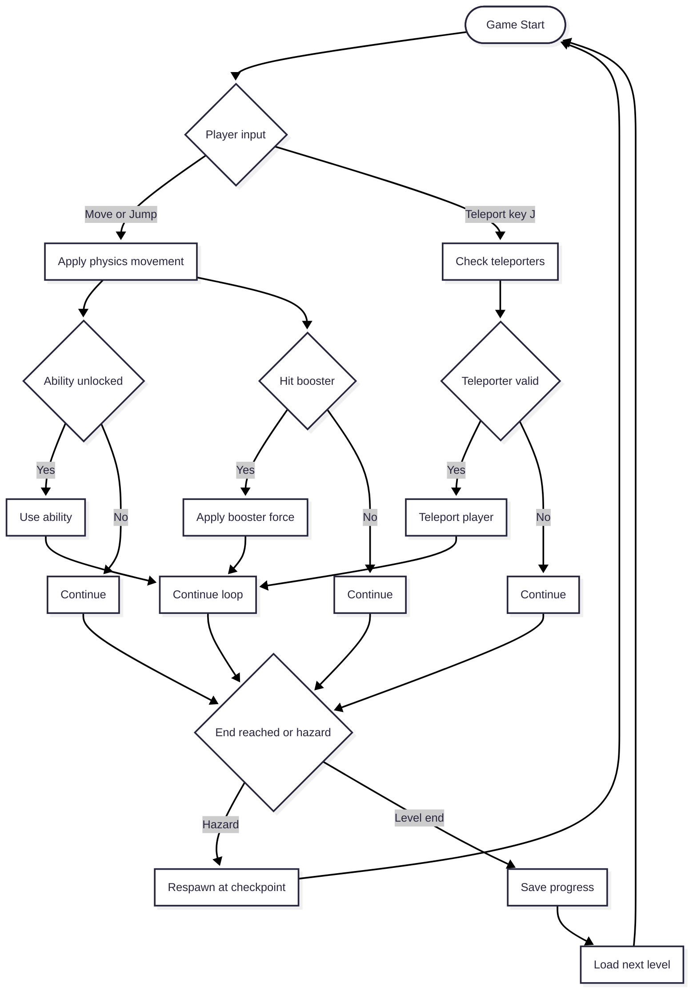
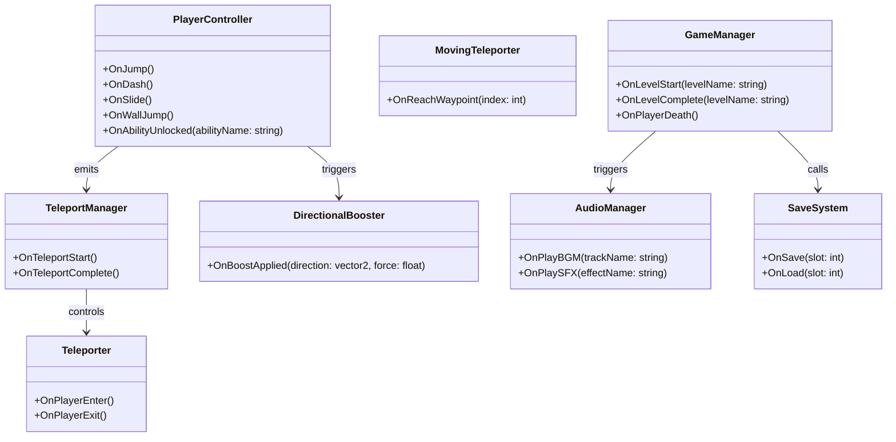

<table>
  <tr>
    <td align="left" width="50%">
      
    </td>
    <td align="right" width="50%">
      
    </td>
  </tr>
</table>

## Scene Flow 

## Layer Design 

## 🎮Scripts and Features

The advanced 2D platformer mechanics including progressive ability unlocks, teleportation system, level management, and dynamic audio are powered by a comprehensive scripting system that creates a unique gameplay experience.

| 📂 Name | 🎬 Scene | 📋 Responsibility |
|---------|----------|-------------------|
| `PlayerController.cs` | **Gameplay** | - Advanced player movement system - Progressive ability unlock (double jump, wall jump, sprint, dash, slide) - Handle player input and physics |
| `TeleportManager.cs` | **Gameplay** | - Core teleportation system management - Allow players to warp between active teleporters using J key - Manage teleporter states and cooldowns |
| `Teleporter.cs` | **Gameplay** | - Base teleporter functionality with visual effects - Handle teleporter activation and momentum preservation - Manage teleporter cooldowns |
| `MovingTeleporter.cs` | **Gameplay** | - Dynamic teleporter that moves between waypoints - Extend base teleporter functionality - Handle moving teleporter physics |
| `GameManager.cs` | **Gameplay** | - Comprehensive level management with save system - Manage camera boundaries and teleporter activation - Handle game state transitions |
| `DirectionalBooster.cs` | **Gameplay** | - Physics-based boost pads with customizable directions - Apply force using different methods - Handle boost pad visual effects |
| `AudioManager.cs` | **Main Menu** **Gameplay**   **End Credit**| - Adapt background music and SFX based on current scene - Set audio volume and mute controls - Manage audio transitions |
| `SaveSystem.cs` | **Persistent** | - Progress persistence allowing players to continue from last reached level - Store and load setting data - Handle save data validation |

 

## 🔴About

WarpPlatform is a 2D platformer where you unlock new movement abilities and navigate levels using teleportation mechanics. Players progress through stages by mastering abilities like double jumping, wall jumping, dashing, and sliding while using strategic teleportation between portals to solve platforming challenges.
 

## 👤Developer & Contributions

- adxze (Game Developer & Systems Designer)
   

## Game Flow Chart

 

## Event Signal Diagram

 

## 🎯Game Controls

The following controls are available for gameplay and ability progression:

| Key Binding | Function                    |
| ----------- | --------------------------- |
| A/D         | Move left/right             |
| W/Space     | Jump / Double Jump*         |
| J           | Teleport to available portal|
| Shift       | Sprint*                     |
| E           | Dash*                       |
| Ctrl        | Slide*                      |
| Esc         | Pause menu                  |

**Note: Abilities marked with * must be unlocked through gameplay progression or not added yet* 

 

## ⚡Key Features

**Physics-Based Movement**: Realistic movement system with proper momentum, gravity, and force calculations that create smooth and responsive character control.

**Teleportation Mechanics**: Master the unique J-key teleportation system to warp between active portals, including moving teleporters that add dynamic puzzle elements.

**Level Management**: Seamless level transitions with automatic save system, dynamic camera boundaries, and context-sensitive teleporter activation.

 

## 🕹️Play Game

<a href="#">Play Now</a>
 

