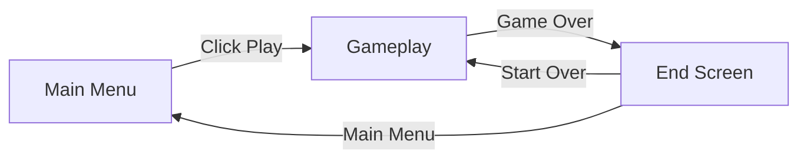
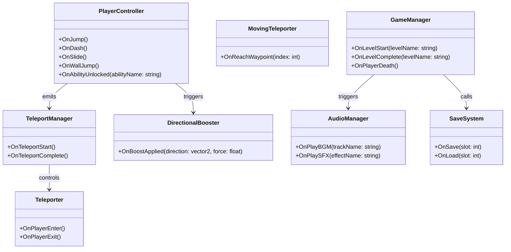

## Developer & Contributions

adxze (Game Developer & Systems Designer)
   

## About

WarpPlatform is a 2D platformer where you unlock new movement abilities and navigate levels using teleportation mechanics. Players progress through stages by mastering abilities like double jumping, wall jumping, dashing, and sliding while using strategic teleportation between portals to solve platforming challenges.
 

## Key Features

**Physics-Based Movement**: Fast paced movement system with proper momentum, gravity, and force calculations that create smooth and responsive character control.

**Teleportation Mechanics**: the unique J-key teleportation system to warp between active portals, including moving teleporters that add dynamic puzzle elements.

<table>
  <tr>
    <td align="left" width="50%">
      
    </td>
    <td align="right" width="50%">
      
    </td>
  </tr>
</table>

## Scene Flow 

## Layer / module Design 

## Modules and Features

The advanced 2D platformer mechanics including progressive ability unlocks, teleportation system, level management, and dynamic audio are powered by a comprehensive scripting system that creates a unique gameplay experience.

| 📂 Name | 🎬 Scene | 📋 Responsibility |
|---------|----------|-------------------|
| **MainMenu** | **Main Menu** | - Show main menu UI - Load gameplay scene when player click play button - Exit game when player exit the game |
| **Setting** | **Main Menu** **Gameplay** | - Show setting menu (UI) - Set audio settings - Configure game preferences |
| **Audio** | **Main Menu** **Gameplay** | - Play audio (BGM & SFX) - Set audio volume - Set audio mute & unmute |
| **PlayerController** | **Gameplay** | - Move player with progressive abilities - Handle double jump, wall jump, sprint, dash, slide - Process player input and physics |
| **TeleportationSystem** | **Gameplay** | - Handle teleportation between portals using J key - Manage teleporter activation and cooldowns - Support moving teleporters with waypoints |
| **LevelManager** | **Gameplay** | - Manage level progression and boundaries - Handle camera boundaries and transitions - Activate teleporters based on context |
| **GameplayMenu** | **Gameplay** | - Handle and show pause game - Go to main menu when user click main menu button - Exit game when player click exit game |
| **GameOver** | **Gameplay** | - Show game over panel - Handle retry & return to main menu - Manage end screen transitions |
| **PowerUpSystem** | **Gameplay** | - Store and manage power up data available in game - Spawn power ups throughout levels - Detect power up triggers and apply effects |
| **PhysicsSystem** | **Gameplay** | - Handle directional boost pads - Apply physics-based movement forces - Manage collision detection and responses |
| **SaveSystem** | **Persistent** | - Store setting data and game progress - Save and load setting data - Enable progress persistence across sessions |

 

## Game Flow Chart

 

## Event Signal Diagram

 

 

## Play The Game

<a href="#">Play Now</a>
 

